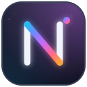

# Aladdin Ali · Naxe

**Backend & platform engineer.** I build systems that stay correct when inputs are messy and dependencies fail: APIs, ingestion pipelines, financial data, and the plumbing between them. I've also been making games since 2015.

**Work:** C# / .NET · TypeScript · Postgres · Redis · Python workers · Next.js
**Care about:** idempotency, retries and failure isolation, reconciliation, auditability, observability

---

### Systems

| | Project | What it proves |
| --- | --- | --- |
|  | [**Cosmic Digest**](https://github.com/NaxeCode/Cosmic-Digest) | .NET RSS ingestion with per-source health, conditional caching, retries and circuit breaking; relevance scoring decides what's worth sending before anything gets sent. |
|  | [**Ground**](https://github.com/NaxeCode/pulse) | Financial-analysis platform foundation: Next.js front end, ASP.NET Core API, Python workers, Redis, Postgres/TimescaleDB, with clean service boundaries. *(WIP)* |
|  | [**Photon Trail**](https://github.com/NaxeCode/Photon-Trail) | Personal-finance pipeline: Plaid ingestion into Neon/Postgres, with AI categorization that returns confidence scores. *(WIP)* |
|  | [**Cosmic Watchlist**](https://github.com/NaxeCode/Cosmic-Watchlist) · [live](https://stargazers-cosmic-watchlist.vercel.app/) | Shipped server-first app: auth, fast CRUD, shareable filters, stats, recommendations. |

### Tools I actually use

| | Tool | What it does |
| --- | --- | --- |
|  | [**ActivityMux**](https://github.com/NaxeCode/activitymux) | Discord Rich Presence from presets and process rules. Windows and Linux [releases](https://github.com/NaxeCode/activitymux/releases/latest). |
|  | [**jp-assist**](https://github.com/NaxeCode/jp-assist) | Real-time Japanese translation for voice calls, running whisper.cpp and llama.cpp locally on AMD ROCm. |
|  | [**caelestia-shell (OLED fork)**](https://github.com/NaxeCode/caelestia-shell-naxecode) | Wayland shell fork with an OLED blackout mode, packaged as an Arch PKGBUILD. |

### Games

| | Game | What it is |
| --- | --- | --- |
|  | [**Minnen**](https://github.com/NaxeCode/Minnen) | A psychological game about night terrors (Haxe, in development). |
|  | [**Ahmar**](https://github.com/NaxeCode/Ahmar) | Top-down action in the spirit of Hyper Light Drifter (Haxe). |
|  | [**CosmicEngine**](https://github.com/NaxeCode/CosmicEngine) | A small 2D engine core in C#: renderer, scene manager, and input. |
